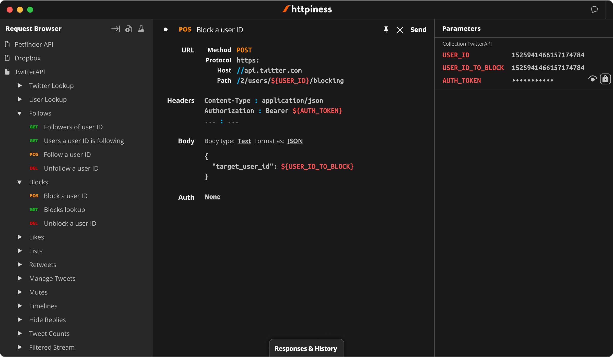

# httpiness

httpiness is a developer-oriented parametric HTTP client for slalom API testing.



## How to run httpiness?

### Build from source (preferred)

```bash
# TL;DR
git clone https://github.com/bognikol/httpiness.git
cd httpiness
# You may need to run the command bellow as an admin for the first time
npm run start:prod:clean
```

1. Make sure Node.js is installed on your machine.
2. Open the shell (you may need to run the shell as admin), navigate to root directory (where package.json is located) and run `npm run start:prod:clean`. This script will clean the repo (if any garbage), install the dependencies, build and finally run httpiness. The script will also build the installers (though not signed).

### Download binaries

Alternatively, you can download Windows and macOS installers at [httpiness.com](https://www.httpiness.com). Current version of binaries is 1.4.2. Be aware that they almost certainly outdated because new binaries are not pushed to the httpiness.com due to signing issues.

## How to use httpiness?

After starting httpiness, click **Help** button in the upper-right corner and help window will be shown. Alternatively, the same help sections can be accessed on [httpiness.com](https://www.httpiness.com/#/docs).

## How is httpiness architectured?

httpiness is an [electron](https://electronjs.org) application which currently acts as a GUI shell for [curl](https://curl.se). curl may be substituted to some other HTTP client in the future.

HTML-based GUI in written using [aflon](https://github.com/bognikol/aflonstack). aflon is a strongly-typed object-oriented UI framework for web.

## Contributing

You are welcome to contribute. Refer to `docs` directory for technical details.
