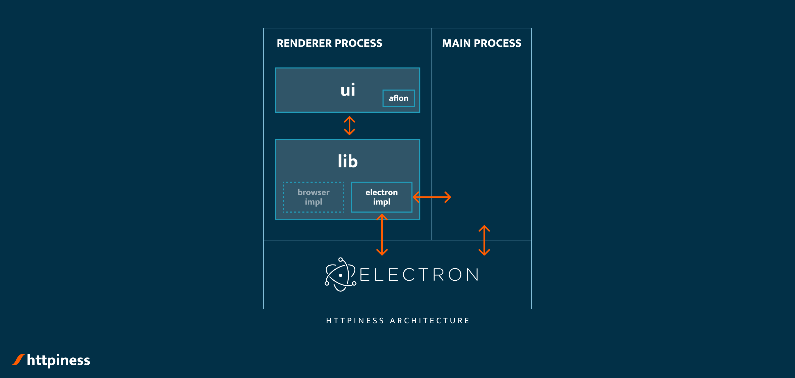
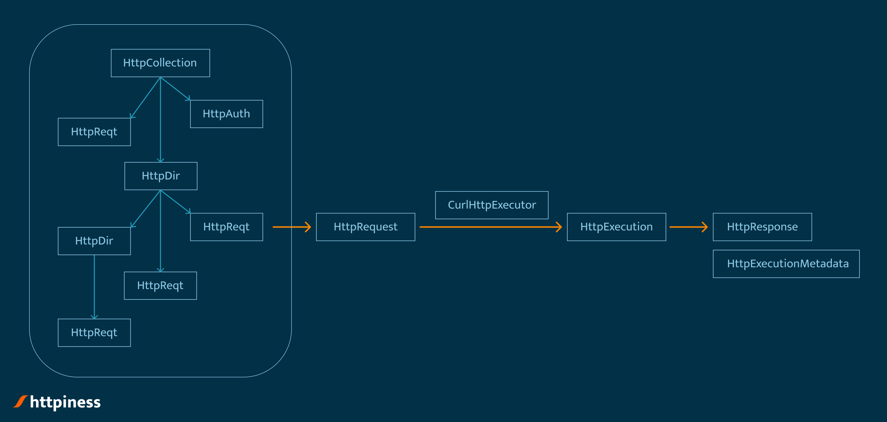

# Architecture of httpiness

httpiness is written using Electron, an extension of Chromium-based browser which allows access to node APIs from within loaded HTML page. This way a simple HTML page escapes its browser-enforced sandbox and gains access to system resources so it can act as a full-fledged desktop app.

Electron runs two independent processes: `main` process and `renderer` process. This architecture is inherited from Chromium.

Each of these processes have independent compilation targets and codebases - which are located in appropriate directories in `./src` folder. Main process is a node application, while renderer process is a classical browser-hosted application with optional access to node APIs and ability to communicate with the main process. Read more about [Electron process model](https://www.electronjs.org/docs/latest/tutorial/process-model).

`./src/renderer` directory, which host codebase for renderer process, is consisted of two modules: `lib` and `ui`. `ui` module contains httpiness GUI written in [aflon](https://github.com/bognikol/aflonstack). `ui` module should use only standard browser JavaScript APIs. `lib` module, on the other hand, should host self-contained business models which depend on node APIs. Goal of this approach is to segregate all non-browser code in `lib` directory, so the code changes would be localized if httpiness is to be ported to the browser.

## Overview of `lib/http`

Classes `HttpRequest` and `HttpResponse` represent plain HTTP request and response respectively. They are essentially plain-old data objects, except they contain simple serialization and caching utility methods.

`HttpRequest` object is passed to method `execute` of `IHttpExecutor` which sends the request and returns instance of `HttpExecution`. `HttpExecution` represents HTTP transaction where a request is sent and a response is received (or is missing). `HttpExecution` contains two fields: `HttpResponse`, which represents actual HTTP response, and `HttpExecutionMetadata`, which contains additional details about HTTP transaction. Implementation of `IHttpExecutor` currently used is `CurlHttpExecutor`. Implementations of `IHttpExecutor`s are stored in `lib/http/executors` directory.

Directory `lib/http/templates` contains a number of classes which are used for implementing httpiness collections - persistable tree-like structures of configurable and parametrizable HTTP requests. There are four main classes in terms of which httpiness collections are implemented:

- **`HttpReqt`** - Reqt is short for Request Template. `HttpReqt` is eventually resolved to a valid sendable `HttpRequest` by resolving all macros (parameters) and inserting authentication-specific details.
- **`HttpAuth`** - Represents authentication approach applicable to particular HTTP request.
- **`HttpDir`** - Represents a node in tree-like structure which is associated with lists of `HttpReqt`s, `HttpAuth`s and other `HttpDir`s.
- **`HttpCollection`** - Represent root `HttpDir` which can be persisted (usually on the file system). Also, it stores values of all macros used in the collection and acts as a dictionary when resolving their values (implements `IMacroContext` interface).

## Macro infrastructure

Internally, httpiness refers to parameters as macros. Thus all interfaces and classes which contains word `Macro` actually refer to infrastructure responsible for handling parameters in httpiness.

Macros behave in search-and-replace fashion: all macro-patterns in string fields are replaced by actual macro values. Macro-patterns have following structure: `${MACRO_NAME}`, where MACRO_NAME is name of the macro.

Values of unlocked macros are stored in plain text in the collection file. Macro can be locked - in which case value of the macro is stored in system's credential manager. For that purpose [keytar](https://www.npmjs.com/package/keytar) library is used. Keytar is a native node module and webpack requires [native-ext-loader](https://www.npmjs.com/package/native-ext-loader) in order to process it.

## Icons font

RapidsIcons is an icon font family specially bundled for httpiness. It is created using [IcoMoon App](https://icomoon.io/app). To add new icon to the font, open icomoon project in the IcoMoon app; the project file is located in `./dist/electron-workspace/resources/icons/fonts/icomoon-project.json`. Once the font is generated and downloaded, update all relevant files in `./dist/electron-workspace/resources/icons` directory.

Icons are referenced in the code using `Icon` element located in `./src/renderer/ui/Icon.ts`.

## curl

httpiness is using curl to send HTTP requests, by spawning new curl process for each HTTP request it is sending. curl binaries are bundled into httpiness distributable. However, majority of OS today (including latest macOS and Windows 10) have curl preinstalled. Therefore, if httpiness cannot load curl from the resources, it will switch to using preinstalled curl. For more details, investigate `src\renderer\lib\http\executors\CurlHttpExecutor.ts`.

## Telemetry

httpiness is reporting heart-bests to the telemetry server. Heart-beats are used to estimate popularity of httpiness. Telemetry server is a simple counter of all reported heart-beats.

A heart-beat is an event that httpiness instance has been run at least once during 24-hour period. Heart-beats are completely anonymous and contain **NO** data.

To disable sending telemetry, add key `DO_NOT_SEND_TELEMETRY` to httpiness.env file in home directory. Read about httpiness.env bellow.

## httpiness.env file

To configure httpiness behavior on user level, create httpiness.env file in home directory. Add `=`-separated key-values to this file. For implementation details, refer to `src\renderer\lib\Environment.ts`.
